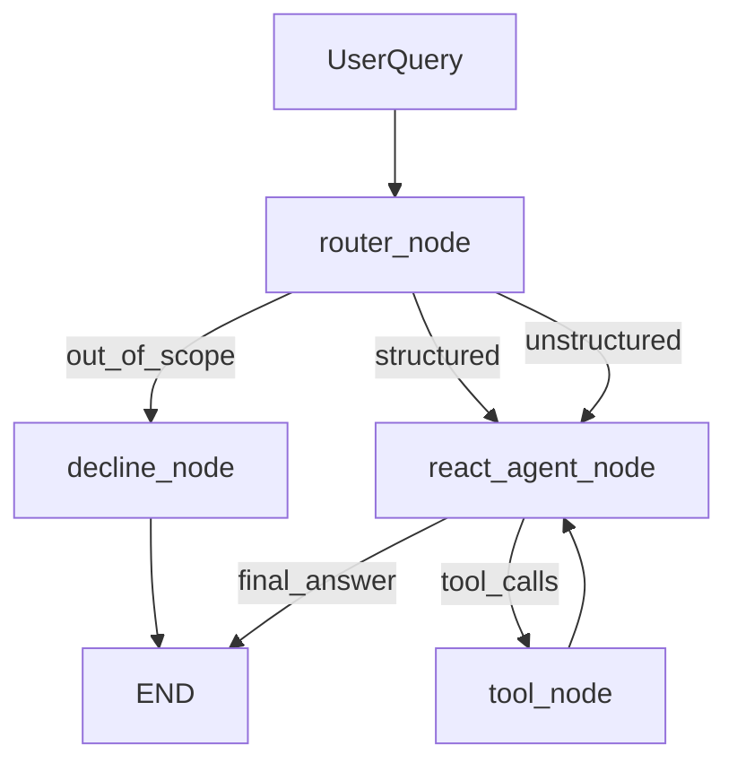

# Bitext Data Analyst ReAct Agent

LangGraph-based ReAct agent that answers questions about the [Bitext Customer Service dataset](https://huggingface.co/datasets/bitext/Bitext-customer-support-llm-chatbot-training-dataset) using composable tools, a dedicated query router, and the Nebius Token Factory API.

## Quick start (about 5 minutes)

### Prerequisites

- Python 3.10+
- [uv](https://github.com/astral-sh/uv) (recommended) or pip
- Nebius Token Factory API key

### Setup

```bash
git clone <your-repo-url>
cd assigment_3

# Install dependencies
uv sync

# Configure API key and models
cp .env.example .env
# Edit .env and set NEBIUS_API_KEY

# Download and cache the dataset
uv run python scripts/download_data.py
```

The download script loads the dataset from Hugging Face. If the download fails (for example, due to network or SSL issues), it falls back to a small synthetic dataset with the same schema so you can still run the agent locally.

### Run the CLI

```bash
uv run python main.py
```

The CLI prints router decisions, tool calls, observations, and the final answer.

Example questions:

- `What categories exist in the dataset?`
- `How many refund requests did we get?`
- `Show me 5 examples of the SHIPPING category.`
- `Summarize how agents respond to complaint intents.`
- `What's the best CRM software for handling complaints?` (out-of-scope)
- `Who is the president of France?` (out-of-scope)

Optional verbose mode:

```bash
uv run python main.py --verbose
```

### Run tests

```bash
uv run pytest tests/ -q
```

## Architecture



1. **Router** classifies each question as `structured`, `unstructured`, or `out_of_scope` before any tool runs.
2. **Decline path** returns a fixed message for out-of-scope questions (no general-knowledge answers).
3. **ReAct loop** binds tools to the agent LLM; structured and unstructured routes use different system prompts.
4. **Max iterations** defaults to 12 (`MAX_ITERATIONS`); the graph returns a graceful fallback if the step limit is reached.

## Tools

| Tool | Purpose |
|------|---------|
| `list_categories` | List all category values |
| `list_intents` | List intents, optionally filtered by category |
| `filter_by_category` | Set working subset to a category |
| `filter_by_intent` | Set working subset to an intent |
| `search_instructions` | Search customer instructions by keyword/phrase |
| `count_rows` | Count rows in the active subset (or full dataset) |
| `sample_rows` | Return example instruction/response pairs |
| `intent_distribution` | Intent counts within a category |
| `get_conversation_texts` | Return texts for summarization (capped) |
| `reset_filter` | Clear the active filter |

Each tool has a Pydantic `args_schema` and a description aimed at the LLM. Multi-step queries chain filters with counting or sampling, for example: `filter_by_intent("get_refund")` → `count_rows()`.

## Model choice (Nebius Token Factory)

| Role | Default model | Why |
|------|---------------|-----|
| Router | `Qwen/Qwen2.5-7B-Instruct` | Fast and inexpensive for classification |
| Agent | `meta-llama/Llama-3.3-70B-Instruct` | Stronger tool selection and summarization |

Override via `.env`:

```env
ROUTER_MODEL=Qwen/Qwen2.5-7B-Instruct
AGENT_MODEL=meta-llama/Llama-3.3-70B-Instruct
NEBIUS_BASE_URL=https://api.tokenfactory.nebius.com/v1/
```

Only Nebius Token Factory models are used for LLM calls.

## Project layout

```
assigment_3/
├── main.py                 # Interactive CLI
├── scripts/download_data.py
├── src/
│   ├── config.py
│   ├── data/               # Loader, cache, sample fallback
│   ├── tools/              # Pydantic-schemas + tool implementations
│   └── agent/              # Router, graph, prompts, CLI helpers
├── tests/
├── pyproject.toml
└── requirements.txt
```

## LangGraph Studio (optional)

```bash
uv run langgraph dev
```

Uses [`langgraph.json`](langgraph.json) to expose the `bitext_analyst` graph.

## MCP and persistent memory

Task 1 implements the core agent and CLI. The tool implementations in `src/tools/` are intended to be reused when adding a FastMCP server and persistent memory in a later task.

## Environment variables

See [`.env.example`](.env.example) for all options.

| Variable | Description |
|----------|-------------|
| `NEBIUS_API_KEY` | Nebius Token Factory API key (required for CLI) |
| `ROUTER_MODEL` | Model for query classification |
| `AGENT_MODEL` | Model for ReAct tool use and answers |
| `MAX_ITERATIONS` | ReAct step limit (default 12) |
| `DATASET_PATH` | Cached parquet path |
