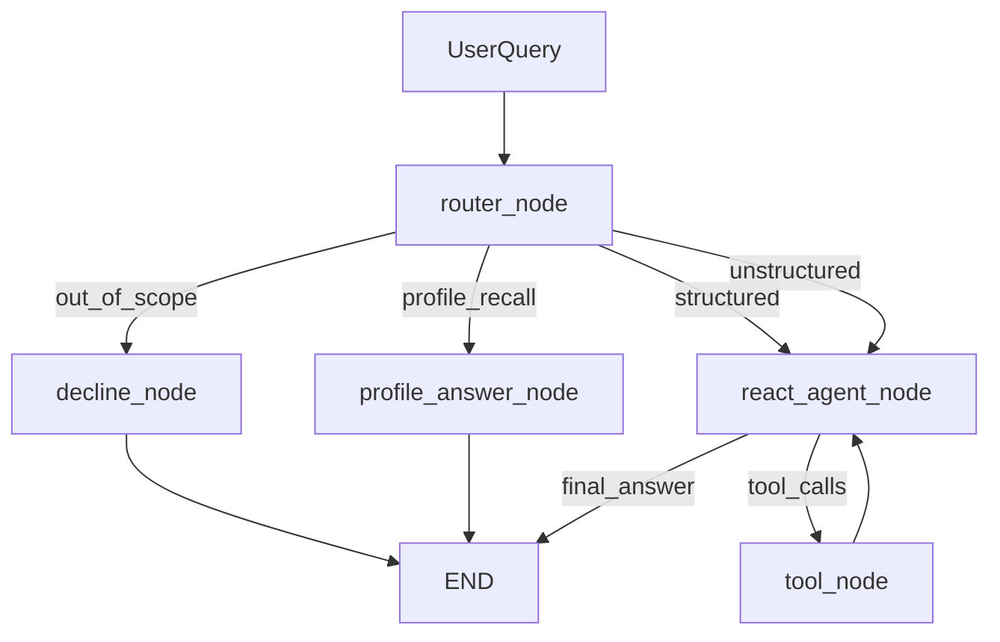

# Bitext Data Analyst ReAct Agent

LangGraph-based ReAct agent that answers questions about the [Bitext Customer Service dataset](https://huggingface.co/datasets/bitext/Bitext-customer-support-llm-chatbot-training-dataset) using composable tools, a dedicated query router, and the Nebius Token Factory API.

## Quick start (about 5 minutes)

### Prerequisites

- Python 3.10+
- [uv](https://github.com/astral-sh/uv) (recommended) or pip
- Nebius Token Factory API key

### Setup

```bash
git clone <your-repo-url>
cd assigment_3

# Install dependencies
uv sync

# Configure API key and models
cp .env.example .env
# Edit .env and set NEBIUS_API_KEY

# Download and cache the dataset
uv run python scripts/download_data.py
```

The download script loads the dataset from Hugging Face. If the download fails (for example, due to network or SSL issues), it falls back to a small synthetic dataset with the same schema so you can still run the agent locally.

### Run the CLI

```bash
uv run python main.py
```

The CLI prints router decisions, tool calls, observations, and the final answer.

### Run the Streamlit chat app

```bash
uv run streamlit run streamlit_app.py
```

The web UI shows each answer in the chat, with an expandable **Reasoning steps** section (router route, tool calls, and observations). Use the sidebar **Session ID** to switch or resume conversations (same checkpoint file as the CLI `--session` flag).

**Conversation memory** — use a session ID so history persists across turns and app restarts:

```bash
uv run python main.py --session my_session
```

The same `--session` value restores prior messages from `data/checkpoints.sqlite` (override with `CHECKPOINT_PATH` in `.env`).

Example follow-up flows (same session):

- `Show me 3 examples from the REFUND category` → `Show me 3 more`
- `How many complaints did we get?` → `What about refunds?` → `What is the total count of the last two?`

Example questions:

- `What categories exist in the dataset?`
- `How many refund requests did we get?`
- `Show me 5 examples of the SHIPPING category.`
- `Summarize how agents respond to complaint intents.`
- `What's the best CRM software for handling complaints?` (out-of-scope)
- `Who is the president of France?` (out-of-scope)

**User profile** — distilled facts per user (name, interests, preferences), separate from session history:

```bash
uv run python main.py --user alice --session chat1
```

Profiles are stored under `data/profiles/` (override with `PROFILE_DIR`). Same `--user` across different `--session` values shares one profile.

Example flows:

- `My name is Alice. From now on show me only 2 examples.` → preference saved; later `sample_rows` should use `n=2`
- `What do you remember about me?` → answers from profile (no dataset tools)

Optional verbose mode:

```bash
uv run python main.py --verbose --session demo --user alice
```

### Run tests

```bash
uv run pytest tests/ -q
```

## Architecture



1. **Router** classifies each question as `structured`, `unstructured`, `profile_recall`, or `out_of_scope` before any tool runs.
2. **Decline path** returns a fixed message for out-of-scope questions (no general-knowledge answers).
3. **ReAct loop** binds tools to the agent LLM; structured and unstructured routes use different system prompts.
4. **Max iterations** defaults to 12 (`MAX_ITERATIONS`); the graph returns a graceful fallback if the step limit is reached.

## Tools

| Tool | Purpose |
|------|---------|
| `list_categories` | List all category values |
| `list_intents` | List intents, optionally filtered by category |
| `filter_by_category` | Set working subset to a category |
| `filter_by_intent` | Set working subset to an intent |
| `search_instructions` | Search customer instructions by keyword/phrase |
| `count_rows` | Count rows in the active subset (or full dataset) |
| `sample_rows` | Return example instruction/response pairs |
| `intent_distribution` | Intent counts within a category |
| `get_conversation_texts` | Return texts for summarization (capped) |
| `reset_filter` | Clear the active filter |

Each tool has a Pydantic `args_schema` and a description aimed at the LLM. Multi-step queries chain filters with counting or sampling, for example: `filter_by_intent("get_refund")` → `count_rows()`.

## Model choice (Nebius Token Factory)

| Role | Default model | Why |
|------|---------------|-----|
| Router | `Qwen/Qwen2.5-7B-Instruct` | Fast and inexpensive for classification |
| Agent | `meta-llama/Llama-3.3-70B-Instruct` | Stronger tool selection and summarization |

Override via `.env`:

```env
ROUTER_MODEL=Qwen/Qwen2.5-7B-Instruct
AGENT_MODEL=meta-llama/Llama-3.3-70B-Instruct
NEBIUS_BASE_URL=https://api.tokenfactory.nebius.com/v1/
```

Only Nebius Token Factory models are used for LLM calls.

## Project layout

```
assigment_3/
├── main.py                 # Interactive CLI
├── scripts/download_data.py
├── src/
│   ├── config.py
│   ├── data/               # Loader, cache, sample fallback
│   ├── tools/              # Pydantic-schemas + tool implementations
│   ├── agent/              # Router, graph, prompts, CLI helpers
│   └── mcp_server/         # FastMCP server (Task 3)
├── tests/
├── pyproject.toml
└── requirements.txt
```

## LangGraph Studio (optional)

```bash
uv run langgraph dev
```

Uses [`langgraph.json`](langgraph.json) to expose the `bitext_analyst` graph.

## Conversation memory (Task 2a)

LangGraph `SqliteSaver` checkpoints store `messages` per session ID (`--session`). Each new user turn appends to the prior history so the agent can answer follow-ups. Delete `data/checkpoints.sqlite` to reset all sessions.

## User profile (Task 2b)

Per-user JSON profiles (`--user`) hold distilled facts, not chat logs. The CLI loads the profile once per REPL, passes it into each `graph.stream()`, injects it into agent prompts (for tool preferences), and updates/saves it after each turn. Delete `data/profiles/{user_id}.json` to reset a user.

## MCP Server (Task 3)

The Bitext dataset tools are also exposed as an MCP server via [FastMCP](https://gofastmcp.com/). The server reuses the same implementations in `src/tools/dataset_tools.py`.

**Prerequisite:** cache the dataset first:

```bash
uv run python scripts/download_data.py
```

### Start the server

**stdio (default)** — for Cursor, Claude Desktop, and other local MCP clients:

```bash
uv run python src/mcp_server/server.py
```

Alternative using the FastMCP CLI:

```bash
uv run fastmcp run src/mcp_server/server.py:mcp
```

**HTTP** — for remote clients or the MCP Inspector:

```bash
uv run python src/mcp_server/server.py --transport http --port 8000
```

### Exposed MCP tools

| Tool | Description |
|------|-------------|
| `list_categories` | List all category values |
| `list_intents` | List intents (optional `category` filter) |
| `filter_by_category` | Set working subset to a category |
| `count_rows` | Count rows in active subset |
| `sample_rows` | Sample examples (`n`, `offset`) |
| `reset_filter` | Clear the active filter |

Filter state is **process-wide**: chain `filter_by_category` → `count_rows` → `sample_rows` in the same server session, or call `reset_filter` between unrelated questions.

### Connect a client

**Cursor** — add to `.cursor/mcp.json` (use your absolute project path for `cwd`):

```json
{
  "mcpServers": {
    "bitext-analyst": {
      "command": "uv",
      "args": ["run", "python", "src/mcp_server/server.py"],
      "cwd": "C:/Dev/nebius/agents/assigment_3"
    }
  }
}
```

**Call one tool from Python** (stdio transport):

```python
import asyncio
from fastmcp import Client

async def main():
    async with Client("uv run python src/mcp_server/server.py") as client:
        result = await client.call_tool("list_categories", {})
        print(result)

asyncio.run(main())
```

For HTTP transport after starting the server on port 8000:

```python
async with Client("http://localhost:8000/mcp") as client:
    result = await client.call_tool("list_categories", {})
```

### Example tool chain

1. `filter_by_category("SHIPPING")`
2. `count_rows()`
3. `sample_rows(n=3)`

## Environment variables

See [`.env.example`](.env.example) for all options.

| Variable | Description |
|----------|-------------|
| `NEBIUS_API_KEY` | Nebius Token Factory API key (required for CLI) |
| `ROUTER_MODEL` | Model for query classification |
| `AGENT_MODEL` | Model for ReAct tool use and answers |
| `MAX_ITERATIONS` | ReAct step limit (default 12) |
| `DATASET_PATH` | Cached parquet path |
| `CHECKPOINT_PATH` | SQLite file for persisted session checkpoints |
| `PROFILE_DIR` | Directory for per-user profile JSON files |
